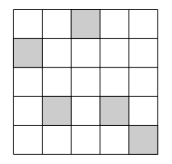
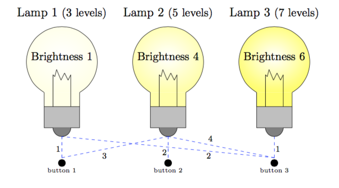

# TikZ-Images

In this repository, we will include code for creating certain TikZ images that have been of use for PLU faculty over the years.


****

# A Lights Out Diagram



  <!--- * [anotacoes_intersecao.pgf](https://github.com/walmes/Tikz/blob/master/src/anotacoes_intersecao.pgf) --->

```tex

\begin{tikzpicture}[thick]
   \draw[black,thick] (0,0) grid (5,5); %draws the five-by-five grid where (0,0) is lower left corner
   \draw[fill=black!20!white] (1,1) rectangle (2,2); %draws a shaded rectangle in the 2,2 spot of the 
   \draw[fill=black!20!white] (4,0) rectangle (5,1); %draws a shaded rectangle at the bottom right corner
   \draw[fill=black!20!white] (3,1) rectangle (4,2);
   \draw[fill=black!20!white] (2,4) rectangle (3,5);
   \draw[fill=black!20!white] (0,3) rectangle (1,4);
\end{tikzpicture}

```

****


# A Highlighted Matrix

```tex

\usetikzlibrary{fit}
\tikzset{%
  highlight/.style={rectangle,fill=blue!75,draw,
    fill opacity=0.3,thick,inner sep=0pt}
}
\newcommand{\tikzmark}[2]{\tikz[overlay,remember picture,
  baseline=(#1.base)] \node (#1) {#2};}
%
\newcommand{\Highlight}[1][submatrix]{%
    \tikz[overlay,remember picture]{
    \node[highlight,fit=(left.north west) (right.south east)] (#1) {};}
}

\[
  M = \left[\begin{array}{*5{c}}
    \tikzmark{left}{1} & 2 & 3 & 4 & 5 \\
    6 & 7 & 8 & 9 & 10 \\
    11 & 12 &13 &   \tikzmark{right}{14}& 15 \\
    16 & 17 & 18 & 19 & 20
  \end{array}\right]
  \Highlight[first]
\]
%\Highlight[second]

```

****



# Some Lightbulbs

```tex

\definecolor{brightyellow}{rgb}{1,1,.4}
\definecolor{midyellow}{rgb}{1,1,.65}
\definecolor{lightyellow}{rgb}{1,1,.9}

\begin{tikzpicture}[scale=.6]
	\node[draw=none] at (1,6.5) {Lamp 1 {\small(3 levels)}};	
	\node[draw=none] at (1+6,6.5) {Lamp 2 {\small(5 levels)}};	
	\node[draw=none] at (1+12,6.5) {Lamp 3 {\small(7 levels)}};	

	\shade[draw=black, inner color=white,outer
color=lightyellow] (2,2) arc (-60:240:2cm);
	\draw[fill=lightyellow, draw=none] (0,1.2) rectangle (2,2);	
	\draw (2,2) -- (2,1.2);
	\draw (0,2) -- (0,1.2);
	\draw (.5,1.2)--(.5,3);
	\draw (1.5,1.2)--(1.5,3);
	\draw (1.5,3)--(1.35,2.7);
	\draw (1.35,2.7)--(1.15,3.1);
	\draw (1.15,3.1)--(.95,2.7);
	\draw (.95,2.7)--(.7,3.3);
	\draw (.7,3.3)--(.6,2.9);
	\draw (.6,2.9)--(.5,3);
	\node[draw=none] at (1,4) {\small Brightness 1};	

	\coordinate (A) at (0,0);
	\coordinate (B) at (0,1.2);
	\coordinate (C) at (2,0);
	\coordinate (D) at (2,1.2);

	\draw[fill=lightgray] (A)--(B)--(D)--(C)--cycle;
	\draw[fill=gray] (1.5,0) arc (0:-180:.5cm); 	
	\draw[fill=black] (1,-2) circle(.2cm);
	\node[draw=none] at (1,-2.4) {\tiny{button 1}};
	\draw[dashed, blue] (1,-1.7)--(1,-.5);

	\shade[draw=black, inner color=white,outer color=midyellow]
(2+6,2) arc (-60:240:2cm);
	\draw[fill=midyellow, draw=none] (6,1.2) rectangle (8,2);
	\draw (2+6,2) -- (2+6,1.2);
	\draw (0+6,2) -- (0+6,1.2);
	\draw (.5+6,1.2)--(.5+6,3);
	\draw (1.5+6,1.2)--(1.5+6,3);
	\draw (1.5+6,3)--(1.35+6,2.7);
	\draw (1.35+6,2.7)--(1.15+6,3.1);
	\draw (1.15+6,3.1)--(.95+6,2.7);
	\draw (.95+6,2.7)--(.7+6,3.3);
	\draw (.7+6,3.3)--(.6+6,2.9);
	\draw (.6+6,2.9)--(.5+6,3);
	\node[draw=none] at (1+6,4) {\small Brightness 4};	

	\coordinate (A) at (0+6,0);
	\coordinate (B) at (0+6,1.2);
	\coordinate (C) at (2+6,0);
	\coordinate (D) at (2+6,1.2);

	\draw[fill=lightgray] (A)--(B)--(D)--(C)--cycle;
	\draw[fill=gray] (1.5+6,0) arc (0:-180:.5cm); 	
	\draw[fill=black] (1+6,-2) circle(.2cm);
	\node[draw=none] at (1+6,-2.4) {\tiny{button 2}};
	\draw[dashed, blue] (1+6,-1.7)--(1+6,-.5);

 	\shade[draw=black,inner color=white,outer color=brightyellow] (2+12,2) arc (-60:240:2cm);
	\draw[fill=brightyellow, draw=none] (12,1.2) rectangle
(14,2);
	\draw (2+12,2) -- (2+12,1.2);
	\draw (0+12,2) -- (0+12,1.2);
	\draw (.5+12,1.2)--(.5+12,3);
	\draw (1.5+12,1.2)--(1.5+12,3);
	\draw (1.5+12,3)--(1.35+12,2.7);
	\draw (1.35+12,2.7)--(1.15+12,3.1);
	\draw (1.15+12,3.1)--(.95+12,2.7);
	\draw (.95+12,2.7)--(.7+12,3.3);
	\draw (.7+12,3.3)--(.6+12,2.9);
	\draw (.6+12,2.9)--(.5+12,3);
	\node[draw=none] at (1+12,4) {\small Brightness 6};	

	\coordinate (A) at (0+12,0);
	\coordinate (B) at (0+12,1.2);
	\coordinate (C) at (2+12,0);
	\coordinate (D) at (2+12,1.2);

	\draw[fill=lightgray] (A)--(B)--(D)--(C)--cycle;
	\draw[fill=gray] (1.5+12,0) arc (0:-180:.5cm); 	
	\draw[fill=black] (1+12,-2) circle(.2cm);
	\node[draw=none] at (1+12,-2.4) {\tiny{button 3}};
	\draw[dashed, blue] (1+12,-1.7)--(1+12,-.5); 	
	\draw[dashed, blue] (1,-1.7)--(1+6,-.5);
	\draw[dashed, blue] (1+12,-1.7)--(1+6,-.5);
	\draw[dashed, blue] (1+12,-1.7)--(1,-.5);

	\node[draw=none] at (.8,-1.2) {\scriptsize{1}};
	\node[draw=none] at (.8+6,-1.4) {\scriptsize{2}};
	\node[draw=none] at (.8+12.4,-1.2) {\scriptsize{1}};
	\node[draw=none] at (3.4,-1.6) {\scriptsize{3}};
	\node[draw=none] at (9.3,-1.6) {\scriptsize{2}};
	\node[draw=none] at (9.4,-.6) {\scriptsize{4}};

   		
\end{tikzpicture}

```

****
