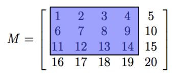

# TikZ-Images

In this repository, we will include code for creating certain TikZ images that have been of use for PLU faculty over the years.


****

# A Lights Out Diagram


  <!--- * [anotacoes_intersecao.pgf](https://github.com/walmes/Tikz/blob/master/src/anotacoes_intersecao.pgf) --->

```tex

\begin{tikzpicture}[thick]
   \draw[black,thick] (0,0) grid (5,5); %draws the five-by-five grid where (0,0) is lower left corner
   \draw[fill=black!20!white] (1,1) rectangle (2,2); %draws a shaded rectangle in the 2,2 spot of the 
   \draw[fill=black!20!white] (4,0) rectangle (5,1); %draws a shaded rectangle at the bottom right corner
   \draw[fill=black!20!white] (3,1) rectangle (4,2);
   \draw[fill=black!20!white] (2,4) rectangle (3,5);
   \draw[fill=black!20!white] (0,3) rectangle (1,4);
\end{tikzpicture}

```

****

# A Highlighted Matrix



```tex

\usetikzlibrary{fit}
\tikzset{%
  highlight/.style={rectangle,fill=blue!75,draw,
    fill opacity=0.3,thick,inner sep=0pt}
}
\newcommand{\tikzmark}[2]{\tikz[overlay,remember picture,
  baseline=(#1.base)] \node (#1) {#2};}
%
\newcommand{\Highlight}[1][submatrix]{%
    \tikz[overlay,remember picture]{
    \node[highlight,fit=(left.north west) (right.south east)] (#1) {};}
}

\[
  M = \left[\begin{array}{*5{c}}
    \tikzmark{left}{1} & 2 & 3 & 4 & 5 \\
    6 & 7 & 8 & 9 & 10 \\
    11 & 12 &13 &   \tikzmark{right}{14}& 15 \\
    16 & 17 & 18 & 19 & 20
  \end{array}\right]
  \Highlight[first]
\]
%\Highlight[second]

```

****

# Some Lightbulbs


```tex

\definecolor{brightyellow}{rgb}{1,1,.4}
\definecolor{midyellow}{rgb}{1,1,.65}
\definecolor{lightyellow}{rgb}{1,1,.9}

\begin{tikzpicture}[scale=.6]
	\node[draw=none] at (1,6.5) {Lamp 1 {\small(3 levels)}};	
	\node[draw=none] at (1+6,6.5) {Lamp 2 {\small(5 levels)}};	
	\node[draw=none] at (1+12,6.5) {Lamp 3 {\small(7 levels)}};	

	\shade[draw=black, inner color=white,outer
color=lightyellow] (2,2) arc (-60:240:2cm);
	\draw[fill=lightyellow, draw=none] (0,1.2) rectangle (2,2);	
	\draw (2,2) -- (2,1.2);
	\draw (0,2) -- (0,1.2);
	\draw (.5,1.2)--(.5,3);
	\draw (1.5,1.2)--(1.5,3);
	\draw (1.5,3)--(1.35,2.7);
	\draw (1.35,2.7)--(1.15,3.1);
	\draw (1.15,3.1)--(.95,2.7);
	\draw (.95,2.7)--(.7,3.3);
	\draw (.7,3.3)--(.6,2.9);
	\draw (.6,2.9)--(.5,3);
	\node[draw=none] at (1,4) {\small Brightness 1};	

	\coordinate (A) at (0,0);
	\coordinate (B) at (0,1.2);
	\coordinate (C) at (2,0);
	\coordinate (D) at (2,1.2);

	\draw[fill=lightgray] (A)--(B)--(D)--(C)--cycle;
	\draw[fill=gray] (1.5,0) arc (0:-180:.5cm); 	
	\draw[fill=black] (1,-2) circle(.2cm);
	\node[draw=none] at (1,-2.4) {\tiny{button 1}};
	\draw[dashed, blue] (1,-1.7)--(1,-.5);

	\shade[draw=black, inner color=white,outer color=midyellow]
(2+6,2) arc (-60:240:2cm);
	\draw[fill=midyellow, draw=none] (6,1.2) rectangle (8,2);
	\draw (2+6,2) -- (2+6,1.2);
	\draw (0+6,2) -- (0+6,1.2);
	\draw (.5+6,1.2)--(.5+6,3);
	\draw (1.5+6,1.2)--(1.5+6,3);
	\draw (1.5+6,3)--(1.35+6,2.7);
	\draw (1.35+6,2.7)--(1.15+6,3.1);
	\draw (1.15+6,3.1)--(.95+6,2.7);
	\draw (.95+6,2.7)--(.7+6,3.3);
	\draw (.7+6,3.3)--(.6+6,2.9);
	\draw (.6+6,2.9)--(.5+6,3);
	\node[draw=none] at (1+6,4) {\small Brightness 4};	

	\coordinate (A) at (0+6,0);
	\coordinate (B) at (0+6,1.2);
	\coordinate (C) at (2+6,0);
	\coordinate (D) at (2+6,1.2);

	\draw[fill=lightgray] (A)--(B)--(D)--(C)--cycle;
	\draw[fill=gray] (1.5+6,0) arc (0:-180:.5cm); 	
	\draw[fill=black] (1+6,-2) circle(.2cm);
	\node[draw=none] at (1+6,-2.4) {\tiny{button 2}};
	\draw[dashed, blue] (1+6,-1.7)--(1+6,-.5);

 	\shade[draw=black,inner color=white,outer color=brightyellow] (2+12,2) arc (-60:240:2cm);
	\draw[fill=brightyellow, draw=none] (12,1.2) rectangle
(14,2);
	\draw (2+12,2) -- (2+12,1.2);
	\draw (0+12,2) -- (0+12,1.2);
	\draw (.5+12,1.2)--(.5+12,3);
	\draw (1.5+12,1.2)--(1.5+12,3);
	\draw (1.5+12,3)--(1.35+12,2.7);
	\draw (1.35+12,2.7)--(1.15+12,3.1);
	\draw (1.15+12,3.1)--(.95+12,2.7);
	\draw (.95+12,2.7)--(.7+12,3.3);
	\draw (.7+12,3.3)--(.6+12,2.9);
	\draw (.6+12,2.9)--(.5+12,3);
	\node[draw=none] at (1+12,4) {\small Brightness 6};	

	\coordinate (A) at (0+12,0);
	\coordinate (B) at (0+12,1.2);
	\coordinate (C) at (2+12,0);
	\coordinate (D) at (2+12,1.2);

	\draw[fill=lightgray] (A)--(B)--(D)--(C)--cycle;
	\draw[fill=gray] (1.5+12,0) arc (0:-180:.5cm); 	
	\draw[fill=black] (1+12,-2) circle(.2cm);
	\node[draw=none] at (1+12,-2.4) {\tiny{button 3}};
	\draw[dashed, blue] (1+12,-1.7)--(1+12,-.5); 	
	\draw[dashed, blue] (1,-1.7)--(1+6,-.5);
	\draw[dashed, blue] (1+12,-1.7)--(1+6,-.5);
	\draw[dashed, blue] (1+12,-1.7)--(1,-.5);

	\node[draw=none] at (.8,-1.2) {\scriptsize{1}};
	\node[draw=none] at (.8+6,-1.4) {\scriptsize{2}};
	\node[draw=none] at (.8+12.4,-1.2) {\scriptsize{1}};
	\node[draw=none] at (3.4,-1.6) {\scriptsize{3}};
	\node[draw=none] at (9.3,-1.6) {\scriptsize{2}};
	\node[draw=none] at (9.4,-.6) {\scriptsize{4}};

   		
\end{tikzpicture}

```

****

# The Trigonometry Functions Explained


```tex
\definecolor{bblue}{rgb}{0.36, 0.54, 0.8}
\definecolor{rred}{rgb}{0.59, 0.0, 0.09}
\definecolor{ggreen}{rgb}{0.01, 0.75, 0.24}
\definecolor{oorange}{rgb}{0.88, 0.66, 0.37}
\definecolor{offwhite}{rgb}{0.95, 0.95, 0.96}
\definecolor{bbrown}{rgb}{0.62, 0.51, 0.44}
\definecolor{ppurple}{rgb}{0.6, 0.4, 0.8}
\definecolor{owhite}{rgb}{1.0, 0.98, 0.8}

\begin{tikzpicture}[scale=3.75]

\draw[black] (0,-1.5) -- (0,1.5);
\draw[black] (-1.5,0) -- (1.5,0);
        \node[] at (.65+.12,.759+.12) {\footnotesize $(x,y)$};

        \node[] at (.2,.1) {\footnotesize $\theta$};

        \node[] at (.13,.3) {\tiny $90-\theta$};

        \node[] at (-.5,-.08) {\footnotesize radius$=1$};

        \node[bblue] at (.77,.3) {\footnotesize sine};
        \node[rred] at (.3,.82) {\footnotesize cosine};

        \node[magenta] at (-.22,.67) {\footnotesize cosecant};

        \node[ggreen] at (.7,-.09) {\footnotesize secant};

        \node[oorange] at (1.35,.4) {\footnotesize tangent};

        \node[ppurple] at (.55,1.1) {\footnotesize cotangent};


\draw[thick, black] (0,0) circle (1);


\draw[line width=.6mm,black] (0,0) -- (-1,0);

\draw[thick,black] (0,0) --  (.65,.759);

\draw[line width=.6mm,bblue] (.65,0) --  (.65,.759);

\draw[line width=.6mm,rred] (0,.759) --  (.65,.759);

\draw[line width=.6mm,ggreen] (0,0) --  (1/.65,0);

\draw[line width=.6mm,magenta] (0,0) --  (0,1/.759);

\draw[line width=.6mm,ppurple] (.65,.759) --  (0,1/.759);

\draw[line width=.6mm,oorange] (.65,.759) --  (1/.65,0);

\draw[thick, fill=black, black] (.65,.759) circle (.04);

\end{tikzpicture}


```

****

# Base 3/2 Tree


```tex
\usetikzlibrary{shapes.geometric}
\begin{tikzpicture}
[every node/.style={inner sep=0pt}]
\node (0) [circle, minimum size=12.5pt, fill=teal, line width=0.625pt, draw=black] at (200.0pt, 28pt) {\textcolor{black}{0}};
\node (1) [circle, minimum size=12.5pt, fill=teal, line width=0.625pt, draw=black] at (200.0pt, -12.5pt) {\textcolor{black}{3}};
\node (2) [circle, minimum size=12.5pt, fill=teal, line width=0.625pt, draw=black] at (200.0pt, -50.0pt) {\textcolor{black}{6}};
\node (3) [circle, minimum size=12.5pt, fill=teal, line width=0.625pt, draw=black] at (137.5pt, -100.0pt) {\textcolor{black}{9}};
\node (4) [circle, minimum size=12.5pt, fill=teal, line width=0.625pt, draw=black] at (262.5pt, -100.0pt) {\textcolor{black}{12}};
\node (5) [circle, minimum size=12.5pt, fill=teal, line width=0.625pt, draw=black] at (100.0pt, -150.0pt) {\textcolor{black}{15}};
\node (6) [circle, minimum size=12.5pt, fill=teal, line width=0.625pt, draw=black] at (312.5pt, -150.0pt) {\textcolor{black}{21}};
\node (7) [circle, minimum size=12.5pt, fill=teal, line width=0.625pt, draw=black] at (212.5pt, -150.0pt) {\textcolor{black}{18}};
\node (8) [circle, minimum size=12.5pt, fill=teal, line width=0.625pt, draw=black] at (62.5pt, -200.0pt) {\textcolor{black}{24}};
\node (9) [circle, minimum size=12.5pt, fill=teal, line width=0.625pt, draw=black] at (262.5pt, -200.0pt) {\textcolor{black}{30}};
\node (10) [circle, minimum size=12.5pt, fill=teal, line width=0.625pt, draw=black] at (162.5pt, -200.0pt) {\textcolor{black}{27}};
\node (11) [circle, minimum size=12.5pt, fill=teal, line width=0.625pt, draw=black] at (362.5pt, -200.0pt) {\textcolor{black}{33}};
\node (12) [circle, minimum size=12.5pt, fill=teal, line width=0.625pt, draw=black] at (25.0pt, -250.0pt) {\textcolor{black}{36}};
\node (13) [circle, minimum size=12.5pt, fill=teal, line width=0.625pt, draw=black] at (100.0pt, -250.0pt) {\textcolor{black}{39}};
\node (14) [circle, minimum size=12.5pt, fill=teal, line width=0.625pt, draw=black] at (162.5pt, -250.0pt) {\textcolor{black}{42}};
\node (15) [circle, minimum size=12.5pt, fill=teal, line width=0.625pt, draw=black] at (225.0pt, -250.0pt) {\textcolor{black}{45}};
\node (16) [circle, minimum size=12.5pt, fill=teal, line width=0.625pt, draw=black] at (300.0pt, -250.0pt) {\textcolor{black}{48}};
\node (17) [circle, minimum size=12.5pt, fill=teal, line width=0.625pt, draw=black] at (400.0pt, -250.0pt) {\textcolor{black}{51}};
\node (18) [circle, minimum size=12.5pt, fill=teal, line width=0.625pt, draw=black] at (12.5pt, -300.0pt) {\textcolor{black}{54}};
\node (19) [circle, minimum size=12.5pt, fill=teal, line width=0.625pt, draw=black] at (50.0pt, -300.0pt) {\textcolor{black}{57}};
\node (20) [circle, minimum size=12.5pt, fill=teal, line width=0.625pt, draw=black] at (100.0pt, -300.0pt) {\textcolor{black}{60}};
\node (21) [circle, minimum size=12.5pt, fill=teal, line width=0.625pt, draw=black] at (137.5pt, -300.0pt) {\textcolor{black}{63}};
\node (22) [circle, minimum size=12.5pt, fill=teal, line width=0.625pt, draw=black] at (187.5pt, -300.0pt) {\textcolor{black}{66}};
\node (23) [circle, minimum size=12.5pt, fill=teal, line width=0.625pt, draw=black] at (225.0pt, -300.0pt) {\textcolor{black}{69}};
\node (24) [circle, minimum size=12.5pt, fill=teal, line width=0.625pt, draw=black] at (275.0pt, -300.0pt) {\textcolor{black}{72}};
\node (25) [circle, minimum size=12.5pt, fill=teal, line width=0.625pt, draw=black] at (325.0pt, -300.0pt) {\textcolor{black}{75}};
\node (26) [circle, minimum size=12.5pt, fill=teal, line width=0.625pt, draw=black] at (412.5pt, -300.0pt) {\textcolor{black}{78}};
\draw [line width=0.625, color=red] (0) to  (1);
\draw [line width=0.625, color=red] (1) to  (2);
\draw [line width=0.625, color=black] (2) to  (3);
\draw [line width=0.625, color=red] (2) to  (4);
\draw [line width=0.625, color=black] (3) to  (5);
\draw [line width=0.625, color=red] (4) to  (7);
\draw [line width=0.625, color=black] (4) to  (6);
\draw [line width=0.625, color=black] (5) to  (8);
\draw [line width=0.625, color=red] (7) to  (10);
\draw [line width=0.625, color=black] (7) to  (9);
\draw [line width=0.625, color=black] (6) to  (11);
\draw [line width=0.625, color=black] (8) to  (12);
\draw [line width=0.625, color=black] (8) to  (13);
\draw [line width=0.625, color=red] (10) to  (14);
\draw [line width=0.625, color=black] (9) to  (15);
\draw [line width=0.625, color=black] (9) to  (16);
\draw [line width=0.625, color=black] (11) to  (17);
\draw [line width=0.625, color=black] (12) to  (18);
\draw [line width=0.625, color=black] (12) to  (19);
\draw [line width=0.625, color=black] (13) to  (20);
\draw [line width=0.625, color=red] (14) to  (21);
\draw [line width=0.625, color=black] (14) to  (22);
\draw [line width=0.625, color=black] (15) to  (23);
\draw [line width=0.625, color=black] (16) to  (24);
\draw [line width=0.625, color=black] (16) to  (25);
\draw [line width=0.625, color=black] (17) to  (26);
\node at (206.25pt, 10pt) {\textcolor{black}{2}};
\node at (206.25pt, -35.625pt) {\textcolor{black}{1}};
\node at (167.5pt, -64.375pt)  {\textcolor{black}{0}};
\node at (232.5pt, -65.0pt) [rotate=0] {\textcolor{black}{2}};
\node at (113.75pt, -116.875pt) [rotate=0] {\textcolor{black}{1}};
\node at (230.625pt, -119.375pt) [rotate=0] {\textcolor{black}{0}};
\node at (290.625pt, -115.625pt) [rotate=0] {\textcolor{black}{2}};
\node at (75.0pt, -168.75pt) [rotate=0] {\textcolor{black}{1}};
\node at (183.125pt, -166.875pt) [rotate=0] {\textcolor{black}{0}};
\node at (244.375pt, -169.375pt) [rotate=0] {\textcolor{black}{2}};
\node at (340.625pt, -165.625pt) [rotate=0] {\textcolor{black}{1}};
\node at (36.25pt, -219.375pt) [rotate=0] {\textcolor{black}{0}};
\node at (88.75pt, -220.625pt) [rotate=0] {\textcolor{black}{2}};
\node at (168.75pt, -227.5pt) {\textcolor{black}{1}};
\node at (236.25pt, -220.0pt) [rotate=0] {\textcolor{black}{0}};
\node at (287.5pt, -218.75pt) [rotate=0] {\textcolor{black}{2}};
\node at (389.375pt, -221.25pt) [rotate=0] {\textcolor{black}{1}};
\node at (10.0pt, -272.5pt) [rotate=0] {\textcolor{black}{0}};
\node at (46.25pt, -272.5pt) [rotate=0] {\textcolor{black}{2}};
\node at (106.25pt, -275.0pt) {\textcolor{black}{1}};
\node at (141.875pt, -270.625pt) [rotate=0] {\textcolor{black}{0}};
\node at (183.125pt, -272.5pt) [rotate=0] {\textcolor{black}{2}};
\node at (231.25pt, -273.125pt) {\textcolor{black}{1}};
\node at (278.75pt, -271.875pt) [rotate=0] {\textcolor{black}{0}};
\node at (322.5pt, -275.625pt) [rotate=0] {\textcolor{black}{2}};
\node at (415pt, -275.625pt) [rotate=0] {\textcolor{black}{1}};
\end{tikzpicture}


```
